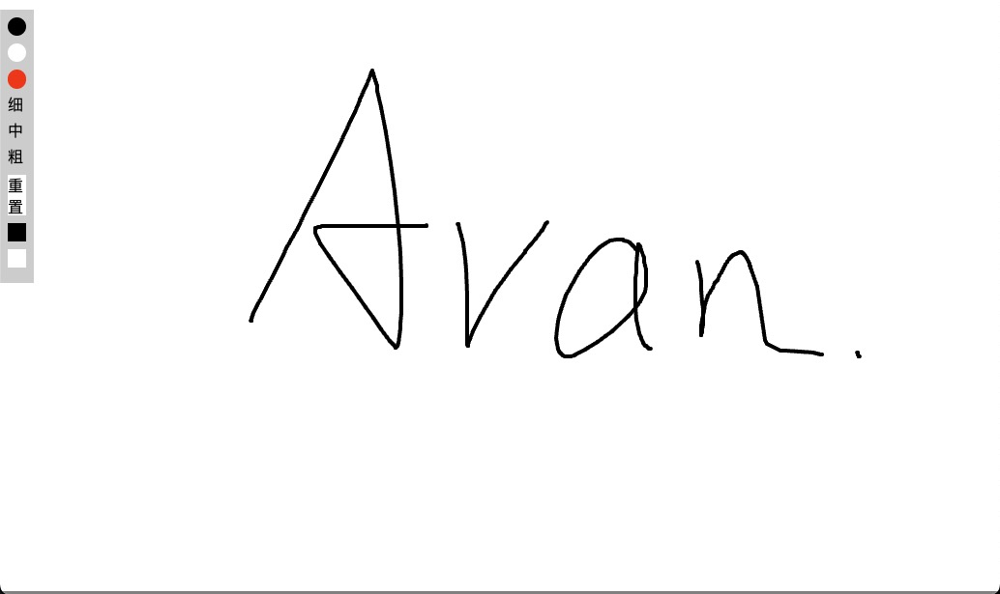

# Art Time

English | [简体中文](./README.zh-CN.md)

## Preview

[https://layouwen.github.io/art-time/](https://layouwen.github.io/art-time/)

## Introduction

A simple drawing board implemented using canvas and native JavaScript, suitable for daily learning, sketching, and as a reference for beginners learning Canvas.

## Features

- Three brush colors
- Three brush thicknesses
- Clear/reset the drawing board
- Background color modification
- Window resize detection
- Mobile device rotation detection
- Support for both PC and mobile devices