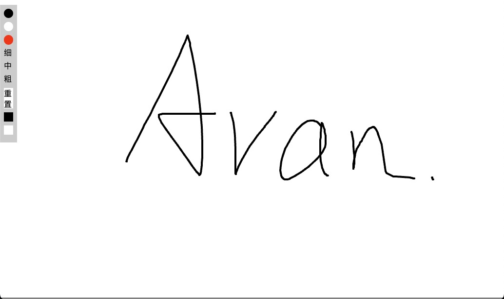

# 艺术时间

[English](./README.md) | 简体中文

## 预览

[https://layouwen.github.io/art-time/](https://layouwen.github.io/art-time/)

## 介绍

使用 canvas、原生 JS 实现简易画板的效果, 可用于日常学习及草稿等. 适合 Canvas 初学者学习参考.

## 功能

- 三种颜色的画笔
- 三种画笔粗细
- 清空/重置画板
- 背景颜色修改
- 窗口改变检查
- 手机翻转检测
- PC/手机端适配